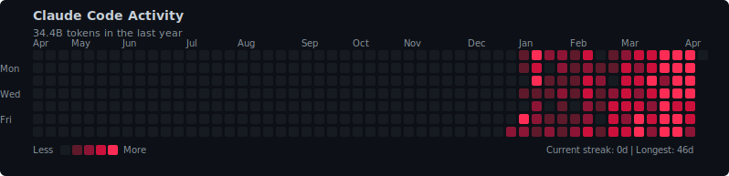
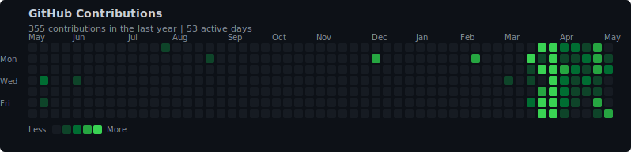

  

  

  &nbsp;
  &nbsp;
  &nbsp;
  

---

### About

I am a Research Assistant Professor at [HKAI-Sci](https://www.cityu.edu.hk/hkai-sci), City University of Hong Kong.
I also work closely with [Prof. Xingjun Ma](https://xingjunm.github.io) at Fudan University.
My research develops robust and efficient RL algorithms for **red & blue teaming** of science and embodied agents.

---

### Featured Research

| Repository | Description | Stars |
| ---------- | ----------- | ----- |
| [Awesome-Embodied-AI-Safety](https://github.com/x-zheng16/Awesome-Embodied-AI-Safety) | Safety in Embodied AI: A Survey of Risks, Attacks, and Defenses (400+ Papers) |  |
| [JustAsk](https://github.com/x-zheng16/JustAsk) | Curious Code Agents Reveal System Prompts in Frontier LLMs |  |
| [System-Prompt-Open](https://github.com/x-zheng16/System-Prompt-Open) | Open database of system prompts extracted from frontier LLMs |  |
| [OpenRedRL](https://github.com/x-zheng16/OpenRedRL) | OpenRedRL: A Light-Weight Benchmark for RL-Based Red Teaming |  |
| [ISC-Bench](https://github.com/wuyoscar/ISC-Bench)    | ISC-Bench: Internal Safety Collapse in Frontier LLMs          |     |

---

### Selected Publications

| Date    | Paper | Venue |
| :-----: | ----- | :---: |
| 2026.03 | [Safety in Embodied AI: A Survey of Risks, Attacks, and Defenses](https://x-zheng16.github.io/Awesome-Embodied-AI-Safety/) | GitHub Preprint |
| 2026.03 | [OpenRedRL: A Light-Weight Benchmark for RL-Based Red Teaming](https://journal.hep.com.cn/fcs/EN/10.1007/s11704-026-51865-8) | **FCS** |
| 2026.02 | [GenBreak: Red Teaming Text-to-Image Generators Using LLMs](https://arxiv.org/abs/2506.10047) | **CVPR** |
| 2026.01 | [Just Ask: Curious Code Agents Reveal System Prompts in Frontier LLMs](https://arxiv.org/abs/2601.21233) | arXiv Preprint |
| 2026.01 | [Safety at Scale: A Comprehensive Survey of Large Model and Agent Safety](https://arxiv.org/abs/2502.05206) | **FnT P&S** |
| 2025.01 | [BlueSuffix: Reinforced Blue Teaming for VLMs Against Jailbreak Attacks](https://arxiv.org/abs/2410.20971) | **ICLR** |
| 2024.12 | [CALM: Curiosity-Driven Auditing for Large Language Models](https://arxiv.org/abs/2501.02997) | **AAAI** |
| 2024.04 | [Constrained Intrinsic Motivation for Reinforcement Learning](https://arxiv.org/abs/2407.09247) | **IJCAI** |
| 2024.03 | [Toward Evaluating Robustness of RL with Adversarial Policy](https://arxiv.org/abs/2305.02605) | **DSN** |
| 2020.06 | [Clean-Label Backdoor Attacks on Video Recognition Models](https://scholar.google.com/citations?user=lqirTjkAAAAJ) | **CVPR** |

<a href="https://scholar.google.com/citations?user=lqirTjkAAAAJ"><i>Full list on Google Scholar</i></a>

---

### GitHub Stats

  

  

  <picture>
    <source media="(prefers-color-scheme: dark)" srcset="cc-heatmap-dark.svg" />
    <source media="(prefers-color-scheme: light)" srcset="cc-heatmap-light.svg" />
    
  </picture>

  <picture>
    <source media="(prefers-color-scheme: dark)" srcset="gh-heatmap-dark.svg" />
    <source media="(prefers-color-scheme: light)" srcset="gh-heatmap-light.svg" />
    
  </picture>

---

  

